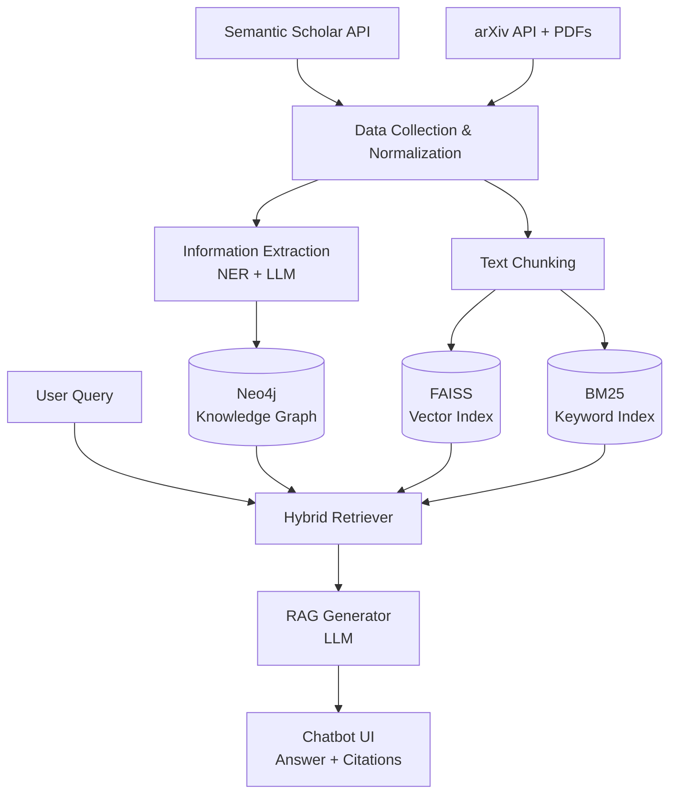

# Scientific Paper Search System (Knowledge Graph + RAG)

A system for searching, exploring, and asking questions over scientific papers. It combines a **Knowledge Graph**, **hybrid search** (keyword + vector), **Retrieval-Augmented Generation (RAG)**, and a **chatbot** to return relevant papers and answer questions with citations to the source papers.

> 🚧 **Status:** Under active development. Phase 1 (Sep – Dec 2026): requirements, architecture, data collection, KG v1, and search baseline. Phase 2 (next semester): RAG, chatbot, UI, and evaluation.

---

## Table of Contents

- [Motivation](#motivation)
- [Features](#features)
- [System Architecture](#system-architecture)
- [Tech Stack](#tech-stack)
- [Project Structure](#project-structure)
- [Getting Started](#getting-started)
- [Roadmap](#roadmap)
- [Team](#team)

---

## Motivation

The number of scientific papers published each year is growing rapidly, and they are scattered across many databases, preprint servers, journals, and open-access archives. Finding the right paper takes more than keyword matching. Researchers also need to understand how papers, authors, topics, methods, datasets, and citations relate to one another.

This project aims to make that easier by representing academic knowledge as a graph, indexing paper content for semantic retrieval, and using an LLM to generate grounded answers that point back to their sources.

## Features

- **Multi-source data collection:** gathers paper metadata from Semantic Scholar and arXiv, extracts full text from PDFs, then normalizes and deduplicates records.
- **Knowledge Graph:** models papers, authors, topics, methods, datasets, and citations as entities and relationships in Neo4j.
- **Hybrid retrieval:** combines BM25 keyword search, FAISS vector search, and Cypher queries on the KG to find the most relevant papers and passages.
- **RAG answering:** generates answers grounded in retrieved content, with citations to the source papers.
- **Conversational chatbot:** supports follow-up questions, paper summaries, method comparisons, related-work discovery, and topic exploration.

## System Architecture



**Pipeline overview**

1. **Collection:** fetch metadata and PDFs from Semantic Scholar and arXiv; extract text with PyMuPDF.
2. **Extraction:** identify entities (methods, datasets, topics) using spaCy NER and LLM-based structured extraction.
3. **Graph construction:** load entities and relationships (authorship, citations, uses-method, uses-dataset) into Neo4j.
4. **Indexing:** split papers into sections and passages, embed them with Sentence-Transformers, and index them in FAISS and BM25.
5. **Retrieval:** merge results from keyword search, vector search, and KG queries.
6. **Generation:** pass retrieved context to an LLM to produce a cited answer.

## Tech Stack

| Component | Technology |
|---|---|
| Language | Python |
| Data sources | Semantic Scholar API, arXiv API |
| PDF processing | PyMuPDF |
| Information extraction | spaCy, LLM prompting |
| Graph database | Neo4j (Cypher) |
| Embeddings | Sentence-Transformers |
| Vector search | FAISS |
| Keyword search | rank_bm25 |
| Generation | LLM-based RAG pipeline |

## Project Structure

```
.
├── data/
│   ├── raw/                      # As downloaded from the sources (git-ignored)
│   └── processed/                # Normalized, deduplicated, chunked (git-ignored)
├── docs/                         # Requirements, architecture, KG schema, learning path
├── notebooks/                    # Exploration and analysis notebooks
├── scripts/
│   └── check_neo4j.py            # Smoke test: connect to Neo4j and print its version
├── src/
│   └── paper_search/
│       ├── config.py             # Settings loaded from .env (single `settings` object)
│       ├── collection/           # Semantic Scholar & arXiv clients, normalization
│       │   └── pdf/              # PyMuPDF text extraction and section splitting
│       ├── extraction/           # spaCy NER and LLM-based entity extraction
│       ├── graph/                # Neo4j schema and loaders
│       ├── indexing/             # Chunking, embeddings, FAISS & BM25 indexes
│       ├── retrieval/            # Search functions
│       ├── rag/                  # Phase 2: prompting and answer generation
│       └── app/                  # Phase 2: API and chatbot UI
├── tests/
├── .env.example
├── docker-compose.yml            # Neo4j 5 Community + APOC
├── Makefile                      # install, neo4j-up, lint, format, test, check-neo4j
├── pyproject.toml                # Package metadata and ruff config
├── requirements.txt              # Runtime dependencies
└── requirements-dev.txt          # pytest, ruff, pre-commit, jupyter
```

The packages currently hold only their docstrings — Phase 1 fills them in.

## Getting Started

### Prerequisites

- Python 3.11+
- Docker (to run Neo4j via `docker-compose.yml`) — or your own Neo4j 5 instance
- A Semantic Scholar API key (optional, but recommended for higher rate limits)
- An LLM API key or a local LLM

### Installation

```bash
git clone <repository-url>
cd <repository-name>

cp .env.example .env    # then fill in NEO4J_PASSWORD and your API keys
make install            # creates .venv and installs everything (editable install)
```

`make install` builds a `.venv`, installs `requirements-dev.txt`, and installs the
project itself with `pip install -e .` so `import paper_search` works anywhere.

### Running Neo4j

`NEO4J_PASSWORD` must be set in `.env` before starting the container — Docker
Compose reads the same file the application does.

```bash
make neo4j-up       # start Neo4j 5 Community with APOC in the background
make check-neo4j    # verify the connection and print the server version
make neo4j-down     # stop it (the named volumes keep your data)
```

The Neo4j browser is then at <http://localhost:7474> and Bolt at `bolt://localhost:7687`.

### Everyday commands

| Command | What it does |
|---|---|
| `make install` | Create the venv and install runtime + dev dependencies |
| `make neo4j-up` / `make neo4j-down` | Start / stop the Neo4j container |
| `make check-neo4j` | Connect to Neo4j and print its version |
| `make lint` | `ruff check` over the repo |
| `make format` | `ruff format` plus `ruff check --fix` |
| `make test` | Run the pytest suite |

Optionally install the git hooks so linting runs on every commit:

```bash
.venv/bin/pre-commit install
```

### Environment variables

See `.env.example` for the full list with defaults.

| Variable | Purpose | Default |
|---|---|---|
| `NEO4J_URI` | Bolt URI of the graph database | `bolt://localhost:7687` |
| `NEO4J_USER` | Neo4j username | `neo4j` |
| `NEO4J_PASSWORD` | Neo4j password (required to start the container) | *(empty)* |
| `SEMANTIC_SCHOLAR_API_KEY` | Higher rate limits on the Semantic Scholar API | *(empty)* |
| `LLM_API_KEY` | Key for the LLM used in extraction and RAG | *(empty)* |
| `DATA_DIR` | Where `raw/` and `processed/` live | `data` |

## Roadmap

The project runs over two semesters. See [ROADMAP.md](ROADMAP.md) for the full task list.

| Phase | Time | Focus |
|---|---|---|
| **Phase 1** (current) | Sep – Dec 2026 | Requirements, architecture, KG model, data collection, KG v1, BM25 + vector search baseline |
| **Phase 2** | Next semester | Hybrid retrieval, RAG with citations, chatbot, API and demo UI, evaluation, final thesis |

**Phase 1**
- [ ] Requirements analysis and architecture design
- [ ] Knowledge Graph schema
- [ ] Data collection from Semantic Scholar and arXiv
- [ ] PDF text extraction and section splitting
- [ ] Entity extraction and KG v1 in Neo4j
- [ ] BM25 and FAISS search baseline
- [ ] Baseline evaluation and Phase 1 report

**Phase 2**
- [ ] Hybrid retriever (keyword + vector + KG)
- [ ] RAG answer generation with citations
- [ ] Chatbot, API, and demo UI
- [ ] Evaluation, ablation, error analysis, and final thesis

## Team

| Member | Responsibilities |
|---|---|
| **Tran Ha My** | Data collection and processing (APIs, PDFs), Knowledge Graph (NER, schema, Neo4j), integration support |
| **Pham Minh Hieu** | Search module (embeddings, FAISS, BM25), RAG module, user interface |

Shared: requirements analysis, architecture design, testing, evaluation, and the final report.