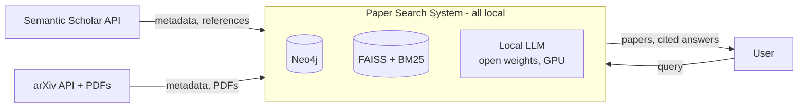
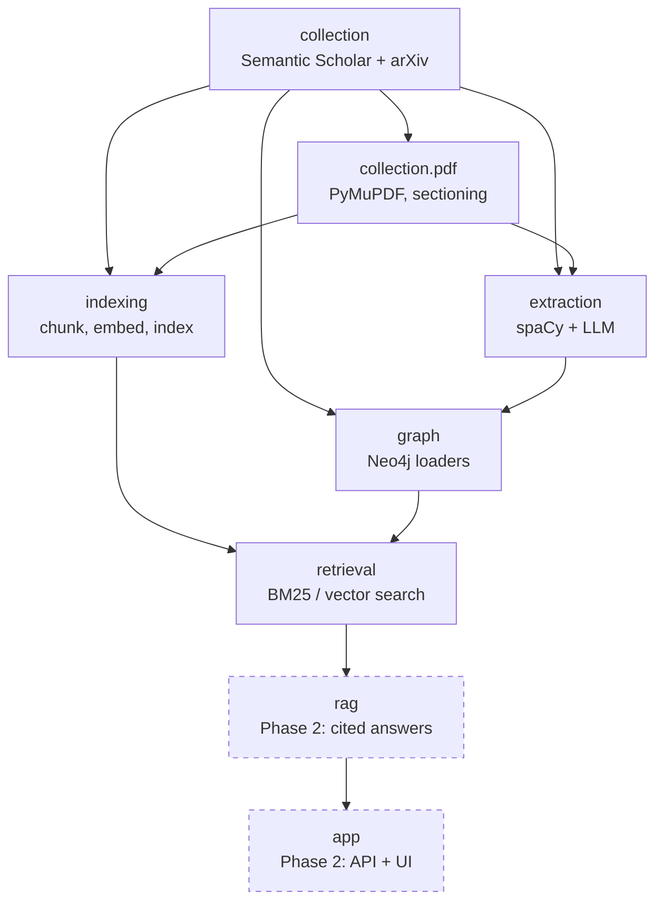
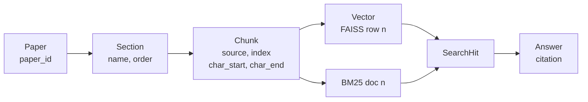
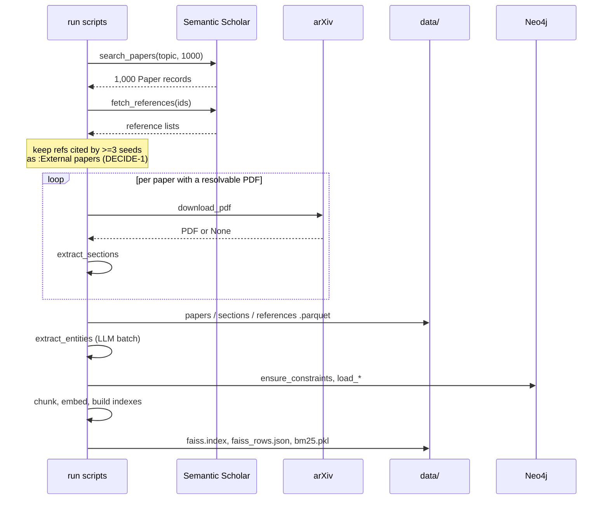

# Architecture

Scientific Paper Search System (Knowledge Graph + RAG) · Roadmap task 1.3

**Status:** draft, 2026-09-24 · **Authors:** Tran Ha My, Pham Minh Hieu

Covers the whole system. Phase 1 stages are built now; Phase 2 stages are specified far
enough that Phase 1 does not paint them into a corner.

Loosely follows [arc42](https://arc42.org/overview): §1 goals and constraints, §2 context,
§3 building blocks, §4 interfaces, §5 provenance (the cross-cutting concept this system
lives or dies by), §6 runtime, §7 storage, §8 failure handling, §9 design decisions.

Requirement IDs (`FR-*`, `NFR-*`, `UC-*`) refer to [`requirements.md`](requirements.md).
Decision IDs (`DECIDE-*`) refer to [`decisions.md`](decisions.md).

---

## 1. Goals and constraints

**What the system does:** given a natural-language query about a research topic, return
relevant papers and — in Phase 2 — an answer grounded in those papers, with citations
pointing to the exact paper and section the text came from.

The constraints that actually shaped the design, all measured rather than assumed:

| # | Constraint | Where it comes from | What it forces |
|---|---|---|---|
| C1 | ~36% of papers have **no full text** | measured, `requirements.md` §2 | Every stage must work on title + abstract alone. Not an edge case — a third of the corpus |
| C2 | The internal citation graph is **sparse** | measured, `S3` | Papers are connected mainly through shared methods, datasets and topics, not through `CITES` |
| C3 | **One GPU, self-hosted inference** | `NFR-12`, `NFR-8` | LLM size bounded by VRAM (`DECIDE-7`). Embedding stays on CPU so indexing never waits on the GPU; exact FAISS index rather than a trained one |
| C4 | **No LLM API, free or paid** | `NFR-8`, course requirement | Open weights, run on the team's own hardware. A free hosted tier is still an API and does not satisfy this. No external LLM dependency and no per-query cost — but also no elastic capacity, so batch work is scheduled rather than parallelized |
| C5 | **Citations must be checkable** | `NFR-4`, `NFR-6` | Provenance is a hard invariant, not a logging nicety — see §5 |
| C6 | Two people, parallel work | `DECIDE-6` | Stage boundaries are contracts (§4), and the shared vocabulary lives in `config.py` |

---

## 2. Context



Everything outside the box is somebody else's system and can fail, rate-limit or change
shape. Those boundaries are where validation and retry live (`NFR-11`, §8).

**The LLM is inside the box.** It runs on the team's own GPU from open weights, so it is not
a boundary that can rate-limit, change behaviour between runs, or bill anything. That also
means its capacity is fixed: a slow extraction run cannot be solved by paying for more
throughput, only by a smaller model or more time.

**Trust boundary:** paper text is untrusted input. It reaches an LLM prompt in `FR-9` and
`FR-19`, so prompts must treat retrieved text as data, never as instructions.

---

## 3. Building blocks



| Package | Responsibility | Input | Output | Lead |
|---|---|---|---|---|
| `collection` | Fetch, normalize and deduplicate paper metadata; resolve and download PDFs | topic query | `Paper` records, PDF files, reference lists | My |
| `collection.pdf` | Extract text, split into canonical sections, clean | PDF file | `Section` records | My |
| `extraction` | Identify methods, datasets, tasks, topics; normalize their names. Local LLM with schema-constrained decoding | `Paper` + `Section` | `PaperEntities` | My |
| `graph` | Schema, constraints, idempotent loaders | `Paper`, `PaperEntities`, references | populated Neo4j | My |
| `indexing` | Chunk with provenance, embed, build FAISS and BM25 | `Paper` + `Section` | chunk table, index files | Hiếu |
| `retrieval` | Top-k search over each index | query string | `SearchHit` list | Hiếu |
| `rag` *(Phase 2)* | Prompting, grounded generation, citations, refusal | `SearchHit` list | answer + citations | Hiếu |
| `app` *(Phase 2)* | REST API and demo UI | HTTP | JSON / HTML | Hiếu |

Each stage reads files written by the previous one and writes its own (§7). No stage calls
another stage's functions. That is deliberate: it lets each stage be re-run alone, which is
what makes debugging and re-tuning affordable (`NFR-10`).

---

## 4. Interfaces between stages

The contracts two people build against in parallel. Types first, then the functions.

### 4.1 Shared types

Plain dataclasses, serialized to Parquet between stages.

```python
@dataclass(frozen=True)
class Paper:
    paper_id: str            # Semantic Scholar ID — the primary key everywhere
    title: str
    abstract: str | None     # missing for ~13% (measured)
    year: int | None
    venue: str | None
    authors: list[str]
    doi: str | None
    arxiv_id: str | None
    citation_count: int
    reference_count: int
    pdf_url: str | None
    has_full_text: bool      # False for ~36% — constraint C1
    is_external: bool        # True = snowballed reference, graph-only (DECIDE-1)
    source: str              # "semantic_scholar" | "arxiv" | "both"
    data_version: str        # the collection run this came from


@dataclass(frozen=True)
class Section:
    paper_id: str
    name: str                # one of config.SECTION_NAMES
    order: int               # position of this section in the paper
    text: str


@dataclass(frozen=True)
class Chunk:
    chunk_id: str            # deterministic: f"{paper_id}:{source}:{index}"
    paper_id: str
    source: str              # "Abstract", or a section name from config.SECTION_NAMES
    index: int               # window index within that source, 0-based
    char_start: int          # offsets into the source text, for exact quoting
    char_end: int
    text: str


@dataclass(frozen=True)
class SearchHit:
    chunk: Chunk
    score: float
    retriever: str           # "bm25" | "vector"
```

`chunk_id` is derived, never generated. Re-running chunking on unchanged input produces the
same IDs, so indexes can be rebuilt without invalidating anything that refers to a chunk
(`NFR-10`). A random UUID here would quietly break that.

### 4.2 Stage functions

```python
# collection
def search_papers(query: str, limit: int = 1000) -> Iterator[Paper]: ...
def fetch_references(paper_ids: Sequence[str]) -> dict[str, list[str]]: ...
def download_pdf(paper: Paper, dest_dir: Path) -> Path | None: ...   # None = unavailable

# collection.pdf
def extract_sections(pdf_path: Path, paper_id: str) -> list[Section]: ...

# extraction
def extract_entities(paper: Paper, sections: list[Section]) -> PaperEntities: ...
def normalize_entity(name: str, kind: str) -> str: ...

# graph
def ensure_constraints(driver: Driver) -> None: ...
def load_papers(driver: Driver, papers: Iterable[Paper]) -> None: ...
def load_citations(driver: Driver, refs: dict[str, list[str]]) -> None: ...
def load_entities(driver: Driver, entities: Iterable[PaperEntities]) -> None: ...

# indexing
def chunk_paper(paper: Paper, sections: list[Section]) -> list[Chunk]: ...
def build_vector_index(chunks: Sequence[Chunk], out_dir: Path) -> None: ...
def build_bm25_index(chunks: Sequence[Chunk], out_dir: Path) -> None: ...

# retrieval
def search_bm25(query: str, k: int = 10) -> list[SearchHit]: ...
def search_vector(query: str, k: int = 10) -> list[SearchHit]: ...
```

Three rules that make these contracts hold:

1. **`download_pdf` returns `None` rather than raising.** A missing PDF is the normal case
   for a third of the corpus (C1), not an error.
2. **`chunk_paper` always returns at least one chunk.** For a metadata-only paper that is
   the abstract, with `source="Abstract"`. A paper with neither full text nor abstract is
   dropped at collection, never silently reaching indexing with zero chunks.
3. **Query embedding is not the caller's job.** `search_vector` applies
   `settings.embedding_query_prefix` internally. The prefix belongs to the query and not to
   the documents, and forgetting it degrades results with no error (`DECIDE-5`) — so there
   is exactly one place it can be forgotten.

---

## 5. Provenance

The cross-cutting concern. `FR-20` requires every generated claim to cite a paper and the
section it came from; `NFR-6` requires 100% coverage. Neither is retrofittable — provenance
has to be attached when text is split, because that is the last moment the position is
known.

### 5.1 The chain



Every arrow must be reversible. The one that breaks by default is `Vector → Chunk`:
**FAISS returns row numbers, not IDs.** The row-to-`chunk_id` mapping is a separate artifact
that has to be written next to the index and loaded with it. Lose it and the index is
scientifically worthless — results cannot be traced to papers.

### 5.2 Invariants

Testable, and worth testing, because each one fails silently:

| # | Invariant | Fails as |
|---|---|---|
| P1 | Every `Chunk` has a non-empty `paper_id` and a `source` in `SECTION_NAMES` ∪ `{"Abstract"}` | citations point nowhere |
| P2 | `chunk.text == source_text[chunk.char_start:chunk.char_end]` | quoted text does not match the paper |
| P3 | `len(faiss_rows) == index.ntotal` and every entry resolves to a known `chunk_id` | results attributed to the wrong paper |
| P4 | `chunk_id` is unique across the corpus and stable across re-runs | duplicate or dangling citations |
| P5 | Every paper reachable from search has `is_external == False` | user gets a paper with nothing to read (`DECIDE-1`) |

### 5.3 Honest citations for metadata-only papers

For the ~36% with no full text, `source` is `"Abstract"`. Answer generation must surface
that distinction rather than hide it: a claim drawn only from an abstract is weaker evidence
than one drawn from a Method section, and `UC-6` explicitly requires the system to say so.

---

## 6. Runtime view

### 6.1 Building the corpus — Phase 1, run once per data version



Stages are separate scripts in `scripts/`, run in order, each re-runnable alone.

### 6.2 Answering a query

**Phase 1** — `search_bm25(q, k)` and `search_vector(q, k)` run independently and their
results are reported separately. This is the point: Roadmap 4.1 measures each one alone, and
those numbers are the baseline Phase 2 has to beat.

**Phase 2** — fuse the two rankings (`FR-16`), expand through the graph (`FR-17`), then
generate from the fused context with citations (`FR-19`, `FR-20`). The graph expansion leans
on `USES_METHOD` / `USES_DATASET` / `HAS_TOPIC` rather than `CITES`, because of C2.

---

## 7. Storage layout

```
data/
├── raw/<data_version>/
│   ├── papers.parquet          # as returned by the APIs, unmodified
│   ├── references.parquet      # paper_id -> referenced paper_id
│   └── pdf/<paper_id>.pdf
└── processed/<data_version>/
    ├── papers.parquet          # normalized, deduplicated
    ├── sections.parquet
    ├── chunks.parquet
    ├── entities.parquet
    ├── faiss.index
    ├── faiss_rows.json         # row number -> chunk_id  (invariant P3)
    ├── bm25.pkl
    └── manifest.json           # versions, counts, embedding model, timestamps
```

`data_version` is the collection date, e.g. `2026-10-05`, and is stamped on every record.
Two runs never overwrite each other, so a result can always be traced to the corpus that
produced it.

**Why raw and processed are separate:** re-running extraction or re-tuning chunking must not
mean re-downloading 640 PDFs. Raw is written once and then read-only.

**`manifest.json` records which embedding model built the index.** Because index-time and
query-time embeddings must match (`DECIDE-5`), searching an index built by a different model
returns plausible-looking nonsense with no error. The manifest makes that checkable at load.

Nothing here is committed — `.gitignore` covers `data/`. Sharing means sharing the scripts
and the `data_version`, not the files.

---

## 8. Failure handling

Failures are expected at every external boundary. What matters is that they are recorded
rather than swallowed, and that one bad paper never stops the run.

| Stage | Failure | Response |
|---|---|---|
| Collection | HTTP 429 | Exponential backoff and retry; never work around bot protection (`NFR-11`) |
| Collection | PDF returns 403 / 404 | Log with reason, keep the paper as metadata-only (`FR-4`) |
| PDF | Text extraction fails or yields almost nothing | Log paper ID and reason, fall back to abstract-only |
| PDF | No heading maps to a canonical section | Assign `"Other"` — never drop the text (`DECIDE-2`) |
| Extraction | Model output does not match the schema | Cannot happen — decoding is schema-constrained. A model that fails to load or times out is logged and the paper skipped |
| Graph | Node already exists | Not a failure — `MERGE` plus uniqueness constraints (`FR-12`) |
| Indexing | A chunk violates P1–P4 | **Abort the build.** A silently wrong index is worse than no index |

The asymmetry is deliberate: collection and extraction degrade gracefully because partial
data is still useful, while indexing fails loudly because a provenance violation invalidates
every downstream result.

Every stage writes a run log listing what was skipped and why. Roadmap 2.3 requires the
failure log; the numbers in it also belong in the Phase 1 report.

---

## 9. Design decisions

Recorded with reasons, per Roadmap 1.3. The six team decisions and their full tradeoffs are
in [`decisions.md`](decisions.md); these are the architectural ones behind them.

### Why Neo4j rather than tables

`UC-2` ("papers evaluating on dataset X with method Y") and `UC-3` (a paper's neighbourhood)
are multi-hop queries over a heterogeneous, sparse set of relationships. In SQL these are
multi-way joins whose shape changes with every new question; in Cypher they are one pattern
each. The schema is also expected to grow — adding a relationship type does not mean a
migration.

**The honest caveat:** C2 means the citation half of the graph is thin, so most of the value
comes from entity-mediated links, not citations. That is worth stating plainly in the Phase 1
report rather than discovering during a defence.

### Why hybrid search, and why Phase 1 keeps the halves apart

BM25 matches exact strings — dataset names, model names, acronyms — which embeddings blur
together: `bge-small` will happily rate "BERT" and "RoBERTa" as near-identical. Vector search
matches paraphrase, which BM25 cannot do at all. The failure modes are complementary, which
is the argument for fusing them in Phase 2.

Phase 1 deliberately does **not** fuse them. Measuring each separately (Roadmap 4.1) is what
turns "hybrid search is better" from an assumption into a result, and gives Phase 2 a
baseline to beat.

### Why an exact FAISS index

At ~20,000 vectors, `IndexFlatIP` is fast enough and loses no recall. `IVF` and `HNSW` trade
recall for speed at corpus sizes orders of magnitude larger than this. Choosing exact search
here is a decision, not an omission, and it removes a confound from the evaluation: any
retrieval miss is the embedding model's fault, not the index's.

Vectors are normalized so inner product equals cosine similarity.

### Why a self-hosted model, and what it costs us

Required by the course: no hosted LLM API. The system therefore runs an open-weights model
on the team's own GPU for both `FR-9` (extraction) and `FR-19` (generation).

What this buys: no per-query cost, no rate limit, no dependency that can change behaviour
between the evaluation run and the defence, and a system that still works with the network
unplugged. For a project whose deliverable is a reproducible measurement, a model that
cannot silently change under us is genuinely worth something.

What it costs: capacity is fixed. A hosted API absorbs a slow batch job by running it in
parallel; a single GPU cannot. Extraction over 1,000 papers is therefore scheduled as an
overnight run rather than treated as interactive. Answer latency also lands an order of
magnitude above a hosted API, which is why `NFR-2` is written as *first token* plus a
streamed completion rather than a single wall-clock number.

### Why schema-constrained decoding rather than prompting for JSON

Small local models are much less reliable than frontier hosted models at producing valid
JSON on request, and `FR-10` (entity normalization) is where that unreliability lands —
exactly the entity-fragmentation failure Tran Ha My named in `DECIDE-4`.

The fix is not a better prompt. Local runtimes can constrain decoding to a JSON schema, so
malformed output is not rejected after the fact — it is never generated. This makes a small
model usable for `FR-9` in a way that prompt engineering alone does not, and it removes the
retry-and-repair path from §8 entirely.

### Why no new dependency for the LLM client

The local runtime speaks HTTP. `requests` is already a dependency, and a schema-constrained
completion is one POST, so no client library is added. Both members can read the request
shape without learning another API.

### Why file-based stages rather than one pipeline object

Each stage reads files and writes files. It is more verbose than an in-memory pipeline, and
it buys three things that matter more: any stage can be re-run alone without repeating the
expensive ones; two people can work on adjacent stages against a file format instead of
against each other's code (C6); and intermediate output can be inspected in a notebook when
something looks wrong.

### Why Parquet for intermediate data

Typed, columnar, compressed, and readable by pandas without a schema declaration. `pandas`
and `pyarrow` are already dependencies. JSON would cost roughly an order of magnitude in
size and lose types on every round trip.

---

## 10. Out of scope

Deployment, containerized serving, horizontal scaling, authentication, and incremental
re-crawling. The deliverable is a local demo (`requirements.md` §6). Stating this is part of
the architecture: it is why nothing here has a service boundary or a queue.
